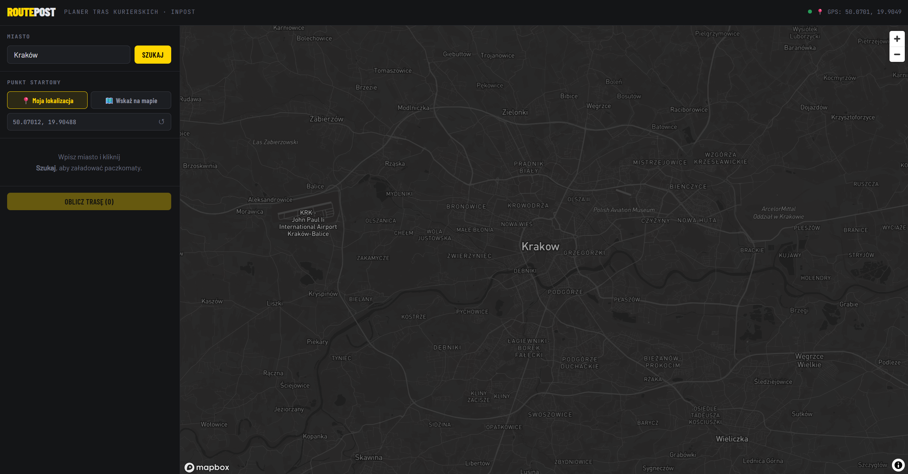
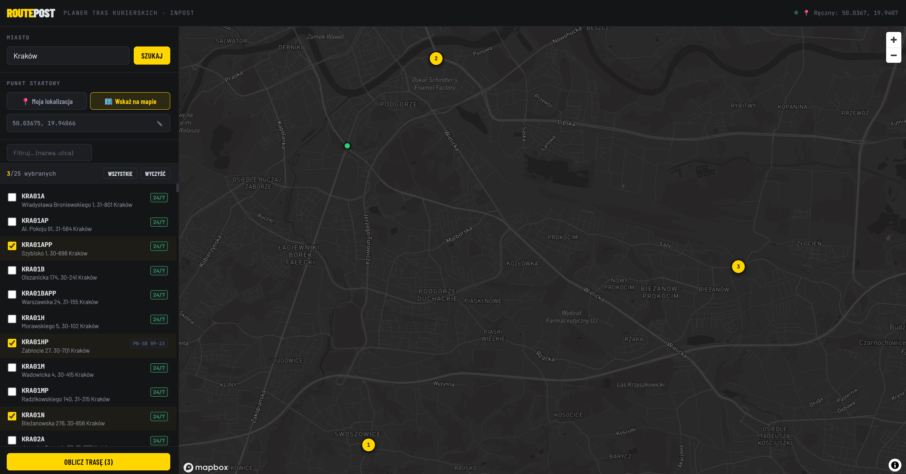
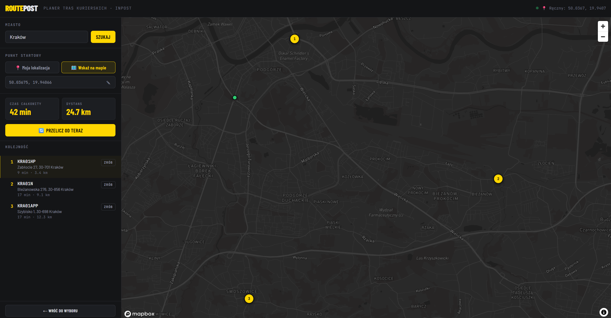

# RoutePost - Courier Route Planner for InPost

## Author

- **Name:** Michalina Kujawa
- **Email:** michalinakujawa2004@gmail.com

## Overview

RoutePost is a web tool for couriers who need to visit multiple InPost parcel lockers in a single shift. It fetches real locker data from the InPost API, lets you select the stops you need to make, and calculates an optimised driving route - ordered, timed, and drawn on a map. As you work through your stops, you can mark them done and recalculate the remaining route from your current GPS position.

## Demo & Description

### What it does

The flow is deliberately simple:

1. **Pick a city** - type any Polish city name and click "Szukaj". The app fetches all operating parcel lockers from the InPost API, transparently paginating through all results.
2. **Select your stops** - a scrollable checkbox list shows every locker with its address and whether it's 24/7. Filter by name or street. Select up to 25.
3. **Calculate the route** - the backend sorts the stops using a nearest-neighbour heuristic, then calls the Mapbox Directions API to get a real road route with traffic-aware timing.
4. **Drive** - the map shows numbered markers and a polyline. The sidebar shows the ordered stop list with per-leg time and distance. Mark each stop as done with the "Zrób" button.
5. **Recalculate mid-route** - the "🔄 Przelicz od teraz" button grabs your current GPS position and recalculates the optimal route for the remaining unvisited stops.

### Architecture

```
Browser (React + Mapbox GL JS)
    │
    ├── GET /api/points?city=X  ──► InPost API (all pages fetched server-side)
    │
    └── POST /api/route { start, points }
            │
            ├── nearest-neighbour sort (backend)
            └── Mapbox Directions API → { geometry, duration, distance, legs }
```

The backend is a thin proxy that (a) aggregates paginated InPost data into a clean array, (b) keeps the Mapbox token server-side, and (c) runs the ordering heuristic. The frontend is stateful but dumb - it just renders what the backend returns.

### Key technical decisions

**Nearest-neighbour instead of Mapbox Optimization API** - Mapbox Optimization v1 caps at 12 waypoints. Nearest-neighbour is O(n²), simple to verify, and for ≤25 stops on a city scale the result is good enough. A courier isn't going to notice a 3% suboptimal ordering.

**Backend proxy for InPost pagination** - the InPost API paginates at ~25–100 items per page. The backend fetches all pages silently so the frontend receives a single clean array. This also sidesteps CORS.

**No database, no auth** - this is a shift-planning tool, not a system of record. There is nothing worth persisting between sessions at this scope.

### Screenshots

### Start view


### Choosing points


### Route recommendation


## Technologies

| Layer | Technology | Why |
|---|---|---|
| Frontend | React 18 + Vite | Fast DX, component model fits the UI naturally, Vite proxy avoids CORS in dev |
| Map | Mapbox GL JS v3 | Best-in-class WebGL maps, native GeoJSON route rendering, good free tier |
| Routing | Mapbox Directions API | Real road routing with traffic, up to 25 waypoints, well-documented |
| Backend | Node.js 20 + Express | Lightweight, ESM-native, single responsibility |
| TSP heuristic | Custom nearest-neighbour | Avoids the 12-waypoint limit of Mapbox Optimization API; sufficient for MVP |
| Styling | Plain CSS with variables | No build config overhead, full control, easy to read in a review context |

## How to run

### Prerequisites

- Node.js 20 or later
- A [Mapbox access token](https://account.mapbox.com/) - the free tier is sufficient

### Build & run

```bash
# 1. Clone the repo
git clone https://github.com/mickuj/courier-route-planner
cd courier-route-planner

# 2. Backend
cd backend
cp .env.example .env
# Open .env and set MAPBOX_ACCESS_TOKEN=pk.your_token_here
npm install
npm run dev
# → running at http://localhost:3001

# 3. Frontend (new terminal tab)
cd ../frontend
cp .env.example .env
# Open .env and set VITE_MAPBOX_TOKEN=pk.your_token_here  (same token)
npm install
npm run dev
# → running at http://localhost:5173
```

Open `http://localhost:5173`. Type a city (e.g. `Kraków`), click **Szukaj**, select some lockers, click **Oblicz trasę**.

### Environment variables

| File | Variable | Description |
|---|---|---|
| `backend/.env` | `MAPBOX_ACCESS_TOKEN` | Used server-side for Mapbox Directions API calls |
| `frontend/.env` | `VITE_MAPBOX_TOKEN` | Used client-side for rendering the Mapbox map tiles |
| `backend/.env` | `PORT` | Optional - defaults to `3001` |

Both point to the same Mapbox token. The backend one never reaches the browser. The frontend one is for map tile rendering, which is standard Mapbox practice (the token can be scoped to specific URLs in the Mapbox dashboard).

## What I would do with more time

**1. Persist visited state in the URL** - encode the stop IDs and visited flags as a URL query param. A courier could bookmark a route or share it with a dispatcher. Highest value, lowest effort.

**2. Locker availability** - the InPost API returns `locker_availability` with A/B/C size data. Surfacing "this locker is likely full" before a courier drives there would save real time.

**3. Departure time for traffic-aware routing** - Mapbox Directions supports `depart_at`. Useful for morning planning: "I'm leaving at 7:30, what's the fastest order?".

**4. PWA / offline cache** - the locker list for a given city changes slowly. Caching it in a service worker would make the app reliable on spotty mobile data.

**5. 2-opt improvement pass** - replace nearest-neighbour with nearest-neighbour + 2-opt local search. For 25 stops it runs in under a millisecond and can meaningfully shorten the total distance.

## AI usage

Claude was used throughout - for code generation, architecture discussion, and README drafting.

Specifically:
- **Backend pagination logic** - I described the InPost API's paging behaviour and Claude wrote the fetch loop. I adjusted the fallback field names (`items` vs `points`) after testing against the real API.
- **Nearest-neighbour implementation** - Claude wrote the initial version; I verified the Haversine formula against a known distance calculator and traced the splice logic by hand.
- **MapView component** - Claude generated the Mapbox marker and popup code. I adapted sizing, popup HTML, and bounds-fitting after seeing it render in the browser.
- **CSS design system** - I described the aesthetic direction (industrial dark theme, InPost yellow) and Claude generated the variables and component styles. I iterated on layout and spacing.
- **README** - drafted with Claude, rewritten in my own voice.

Every generated file was read line by line. Where something was unfamiliar (e.g. `AbortSignal.timeout()`) I checked the MDN docs before keeping it.

## Anything else?

The InPost API at `api-global-points.easypack24.net` is publicly accessible without authentication - I confirmed this by exploring it directly before writing any code. The response envelope uses `items` as the array key, and `total_count` drives the pagination loop. Filtering by `type=parcel_locker` on the API side is cleaner than post-filtering - the API supports it and meaningfully reduces payload size for cities with mixed point types.

One deliberate UX choice: if geolocation permission is denied, the route calculation still works - the backend falls back to the centroid of the selected points as the start. The app is fully functional on desktop where GPS isn't available.